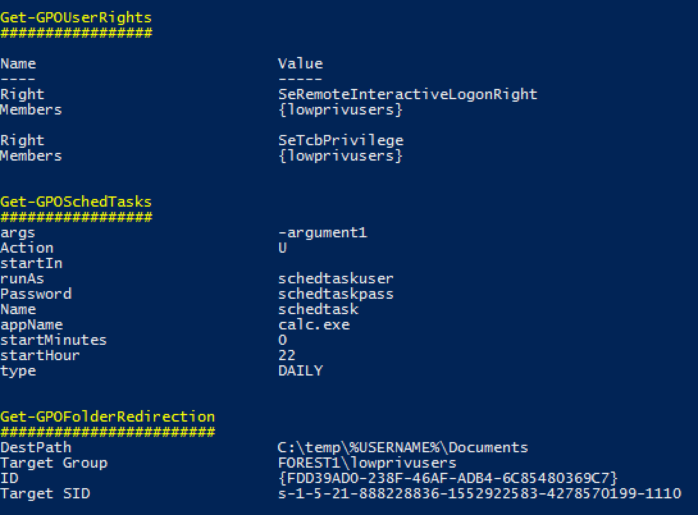

# Grouper

A PowerShell script for helping to find vulnerable settings in AD Group Policy.


###### *Photo by Jon Hanson* - <https://www.flickr.com/people/61952179@N00?rb=1> - <https://creativecommons.org/licenses/by-sa/2.0/>

## Summary
Grouper is a slightly wobbly PowerShell module designed for pentesters and redteamers (although probably also useful for sysadmins) which sifts through the (usually very noisy) XML output from the Get-GPOReport cmdlet and identifies all the settings defined in Group Policy Objects (GPOs) that might prove useful to someone trying to do something fun/evil.

Examples of the kinds of stuff it finds in GPOs:
* Startup and shutdown scripts 
    * arguments and script themselves often include creds.
    * scripts are often stored with permissions that allow you to modify them.
* MSI installers being automatically deployed
    * again, often stored somewhere that will grant you modify permissions.
* Good old fashioned Group Policy Preferences passwords.
* Autologon registry entries containing credentials.
* Other creds being stored in the registry for fun stuff like VNC.
* Scheduled tasks with stored credentials.
    * Also often run stuff from poorly secured file shares.
* User Rights
    * Handy to spot where admins accidentally granted 'Domain Users' RDP access or those fun rights that let you run mimikatz even without full admin privs.
* Tweaks to local file permissions
    * Good for finding those machines where the admins just stamped "Full Control" for "Everyone" on "C:\Program Files".
* File Shares
* INI Files
* Environment Variables
* ... and much more! (well, not very much, but some)

Yes it's pretty rough, but it saves me an enormous amount of time reading through those awful 150MB HTML GPO reports, and if it works for me it might work for you.

## Usage

Generate a GPO Report on a windows machine with the Group Policy cmdlets installed. 
These are installed on Domain Controllers by default, can be installed on Windows clients using RSAT, or can be enabled through the "Add Feature" wizard on Windows servers.

```
Get-GPOReport -All -ReportType xml -Path C:\temp\gporeport.xml
```

Import the Grouper module.

```
Import-Module grouper.ps1
```

Run Grouper.

```
Invoke-AuditGPReport -Path C:\temp\gporeport.xml
```

## Switches
There's also a couple of switches you can turn on that alter which policy settings Grouper will show you:

```
-showDisabled
```
By default, Grouper will only show you GPOs that are currently enabled and linked to an OU in AD. This toggles that behaviour.
```
-showLessInteresting
```
By default, if Grouper is able to tell the difference between a 'might be bad' policy setting and an 'almost definitely bad' policy setting, it will only show you 'almost definitely bad'.

e.g. by default Grouper will only show you:
* a local user account being modified via Group Policy Preferences IF the setting includes credentials. 
* a registry key being set via Group Policy if it matches a certain set of common keys that store credentials.
* etc.

With -showLessInteresting turned on, it shows all the 'might be bad'.

___

## Questions that I am anticipating

### I don't have a lab environment and I don't have a GPO report file handy! I'm also very impatient!
I got your back, kid. There's a test_report.xml in the repo that you can try it out with. It's got a bunch of bad settings in it so you can see what that looks like.

You'll need to run it with the -showDisabled flag because it's so full of really awful configurations I didn't even want to enable the GPO in a lab environment.

### I'm even more impatient than that last guy and I demand pretty pictures immediately!
OK.



### But wait, how do I figure out which users/computers these policies apply to? Your thing is useless!
Short Answer: PowerView will do a decent job of this.

Longer Answer: I'll be trying to add this functionality at some point but in the teamtime, shut up and use PowerView.

### I hate one of the checks Grouper does and I never want to see it again.

Cool, easily fixed. 

Pop open grouper.ps1, find the "$polchecks" array and just comment out the line where that check gets added to the array.

Done.

### I want to make Grouper better but I can't make sense of your awful spaghetti-code. Help me help you.

Sure thing, sounds good.

1. Get some GPOReport xml output that includes the type of policy/setting you want Grouper to be able to find. This may require knocking up a suitable policy in a lab environment.

2. Find the \<GPO\> xml object that matches your target policy.

3. Find the subsection of the xml that matches the info you want to pull out of the policy. Policy settings are divided into either User or Computer policy, so this will usually be in either:
    ```
    GPO.Computer.ExtensionData.Extension
    or
    GPO.User.ExtensionData.Extension
    ```

4. Now's the annoying part - the reason this code is such a mess is that each policy setting section is structured differently and they use wildly differing naming conventions, so you're going to need to figure out how your target policy is structured. Good luck?

6. Here's a skeleton of a check function you can use to get started. Make sure it either doesn't return at all or returns $null if nothing interesting is found.

    ```
    Function Get-GPOThing {
        [cmdletbinding()]
        Param ($polXml)

    	$settingsThings = ($polXml.ThingSettings.Things | Sort-Object   GPOSettingOrder)

        if ($settingsThings) {
    	    foreach ($setting in $settingsThings) {
                $output = @{}
                $output.Add("ThingName", $setting.Name)
                $output.Add("ThingDescription",     $setting.properties.Description)
                $output.Add("ThingAnnoyingEdgeCase",    $setting.properties.edgecase.InnerText)
                $output

            }
        }
    }
    ```

7. Ctrl-f your way down to "$polchecks" and add it to the array of checks with the others.

8. Test it out.

9. If it works, submit a pull request!

10. If you get stuck, hit me up. I'll try to help if I can scrounge a few minutes together.

___

## Credits, complaints, comments, death threats, errata

Thank you very much to:
* @harmj0y for his GPP password decryption helper function.
* @sysop_host and @prashant3535 for their assistance and encouragement. I believe there is probably still a line or two stolen from @sysop_host still in this thing but I'm really not sure where and I would hate to blame him for my shitty code.

Speaking of shitty code, yes I know this is a bit of a mess. I've tried to make it as modular as possible so others should be able to add additional checks without too much hassle, but it still needs a lot of love. If you see a mistake I've made that desperately needs fixing, please let me know.

## TODO

* Add explanations to each check function to provide guidance on what to look for to see if a thing is vulnerable, how to exploit vulnerable configs, etc.
* Remove reliance on RSAT/Group Policy cmdlets to generate the initial report or fold the required code into this script so it can be run on any machine with PS installed.
* Implement more checks to separate 'could be bad' configurations from 'almost certainly bad'.
* Implement checks for some of the more common non-default Group Policy templates, e.g. MS Office, Citrix, etc.
